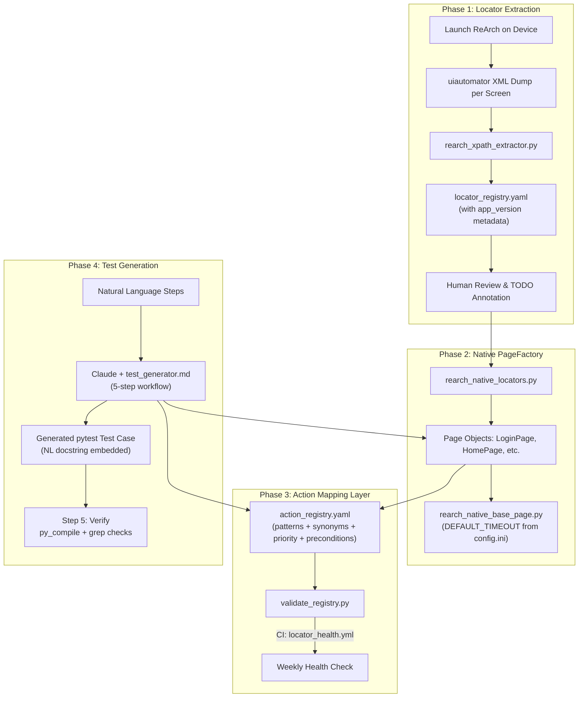

# ReArch Native Test Generation Architecture

## Current State

All four phases are **fully implemented and operational**. The pipeline converts numbered natural language steps into executable pytest + Appium test cases for the ReArch POS app (`com.razorpay.pos`) without any WebView context switching.

---

## Architecture Overview



---

## Phase 1: Locator Extraction

**Files:** `Tools/rearch_xpath_extractor.py`, `Tools/output/xml_dumps/`, `Tools/output/locator_registry.yaml`

### What is implemented

- **Interactive screen capture** (`--interactive`): walks through 12 defined screens, dumps uiautomator XML per screen, generates `rearch_locators_generated.py` and `locator_registry.yaml`.
- **Screen registry** prevents duplicate class names across sessions.
- **Three-tier locator priority**: resource-id (`AppiumBy.ID`) → `@text` XPath → **TODO annotation** (no `@index` fallback).
- **App version metadata**: at capture time, `adb dumpsys package com.razorpay.pos` is called to record `versionName` in the registry.
- **`--validate` mode**: connects to Appium, walks each screen interactively, tests every locator, outputs a CSV report.
- **`--regenerate` mode**: re-processes all saved XML dumps without needing a connected device.

### locator_registry.yaml format

```yaml
metadata:
  package: com.razorpay.pos
  app_version: "2.3.1"
  captured_at: "2026-03-15T10:22:00"
screens:
  HomeAmountLocators:
    source_xml: HomeAmountLocators.xml
    captured_at: "2026-03-15 10:22"
    element_count: 18
    elements:
      btn_1: { by: "AppiumBy.XPATH", value: "//android.widget.Button[@text='1']", type: "action" }
      btn_menu: { by: "TODO", value: "no resource-id or text; class=android.widget.Button index=0", type: "unknown", needs_annotation: true }
```

### @index locator policy

`@index`-based XPaths are **not generated**. When the extractor cannot find a resource-id or `@text` for an element, it emits a `# TODO: needs stable locator` comment instead. Existing `@index` locators in `rearch_native_locators.py` are annotated with `# TODO:` inline comments for human follow-up.

### Defined screens

| Screen Name              | Navigation Instruction                                          |
|--------------------------|-----------------------------------------------------------------|
| `LoginLocators`          | Login screen (username/password fields visible)                 |
| `HomeAmountLocators`     | Home page with numpad                                           |
| `PaymentMethodLocators`  | Payment method selection overlay after entering amount          |
| `OrderDetailsLocators`   | Order details overlay (Order ID / Device Serial fields)         |
| `QRPaymentLocators`      | UPI QR code display screen                                      |
| `CashConfirmLocators`    | Cash payment confirmation screen                                |
| `PaymentSuccessLocators` | Payment successful result screen                                |
| `PaymentFailedLocators`  | Payment failed result screen                                    |
| `TxnHistoryLocators`     | Transaction history list                                        |
| `TxnSearchLocators`      | Transaction search screen                                       |
| `TxnDetailLocators`      | Single transaction detail view                                  |
| `MenuLocators`           | Menu / dashboard page                                           |

---

## Phase 2: Native PageFactory

**Files:** `PageFactory/ReArch/rearch_native_locators.py`, `PageFactory/ReArch/rearch_native_base_page.py`, `PageFactory/ReArch/rearch_*.py`

### What is implemented

- **`rearch_native_locators.py`**: all AppiumBy locators, grouped by screen class. No `By.CSS_SELECTOR`. Existing `@index` locators annotated with `# TODO:`.
- **`rearch_native_base_page.py`**: base page with `wait_for_element`, `perform_click`, `fetch_text`, scroll/swipe helpers. Stays in `NATIVE_APP` context permanently. Reads `DEFAULT_TIMEOUT` from `config.ini [Appium]`.
- **Page objects** (login, home, qr, complete, txn_history, txn_detail, payment_method, cash_confirm): all inherit from `ReArchNativeBasePage`, import from `rearch_native_locators`.
- **Old WebView files deprecated**: `rearch_base_page.py` and `rearch_locators.py` emit `DeprecationWarning` on import; they must not be used in new tests.

### Configurable timeout

```ini
# Configuration/config.ini
[Appium]
element_wait_timeout = 45
```

```python
# rearch_native_base_page.py
DEFAULT_TIMEOUT = int(ConfigReader.read_config("Appium", "element_wait_timeout"))

def wait_for_element(self, locator, time: int = DEFAULT_TIMEOUT):
    ...
```

### File reference

| File | Purpose |
|------|---------|
| `rearch_native_locators.py` | All AppiumBy locators, grouped by screen |
| `rearch_native_base_page.py` | Base class: waits, clicks, scrolls, app lifecycle |
| `rearch_login_page.py` | Login screen interactions |
| `rearch_home_page.py` | Amount entry, payment method selection |
| `rearch_qr_page.py` | UPI QR screen validation |
| `rearch_complete_page.py` | Payment result screen |
| `rearch_txn_history_page.py` | Transaction history list |
| `rearch_txn_detail_page.py` | Transaction detail view |
| `rearch_payment_method_page.py` | Payment method overlay |
| `rearch_cash_confirm_page.py` | Cash confirmation screen |
| `rearch_base_page.py` | **DEPRECATED** — WebView base page |
| `rearch_locators.py` | **DEPRECATED** — WebView/HTML locators |

---

## Phase 3: Action Mapping Layer

**Files:** `Tools/action_registry.yaml`, `Tools/validate_registry.py`

### What is implemented

`action_registry.yaml` is the semantic bridge between natural language steps and PageFactory method calls. It contains:

- **`page_objects`** section: centralised import + init snippets per page class (emitted once per test).
- **`synonyms`** block: extends NL pattern coverage without duplicating entries.
- **`actions`** list: each entry has `patterns`, `page`, `method`, `code`, and optionally `priority` and `preconditions`.

### Key structural additions

```yaml
synonyms:
  enter:  [input, type, key in, set, fill, put, add, specify]
  click:  [tap, press, select, choose, hit]
  verify: [validate, check, assert, confirm, ensure]
  amount: [price, value, sum, figure, total]

actions:
  - patterns: ["click cash", "select cash", "pay by cash"]
    page: ReArchHomePage
    method: click_pay_by_cash
    code: "home_page.click_pay_by_cash()"
    priority: 1
    preconditions:
      org_settings:
        cashEnabled: "true"
      revert_on_finally:
        cashEnabled: "false"
```

When multiple patterns match the same NL step, the entry with the highest `priority` value wins. The `preconditions` block is read by the test generator to auto-emit `org_settings_update` calls in SETUP and revert calls in `finally`.

### Registry validation

`Tools/validate_registry.py` statically validates every `code:` snippet:
1. Parses the `method` field from each action.
2. Imports the declared page object class.
3. Uses `inspect.getmembers()` to verify the method exists.
4. Exits with code 1 if any method is missing — catches registry drift immediately.

```bash
python Tools/validate_registry.py
```

---

## Phase 4: Test Generation Skills

**Files:** `.claude/skills/test_generator.md`, `test_template.md`, `test_preconditions.md`, `test_validations.md`, `page_factory_builder.md`

### What is implemented

`test_generator.md` is the entry point skill with a **5-step workflow**:

1. **Read** `Tools/action_registry.yaml` (patterns + synonyms).
2. **Match** each NL step (case-insensitive; use synonyms to expand coverage; use priority to resolve conflicts).
3. **Collect** unique page objects (imports/inits emitted once each).
4. **Generate** the test file using `test_template.md`; embed NL steps as structured docstring.
5. **Verify** before presenting:
   - `python -m py_compile <file>` — syntax OK
   - `grep "initialize_app_driver"` — must be empty
   - `grep "By\.CSS_SELECTOR"` — must be empty
   - `grep "appium_driver"` — must be empty
   - `grep "validateAgainstDB\|validateAgainstPortal"` — must be empty for ReArch tests

### Sub-documents

| File | Content |
|------|---------|
| `test_generator.md` | Entry point: role, 5-step workflow, locator rules, driver rules |
| `test_template.md` | Complete Python test file template with all sections |
| `test_preconditions.md` | `org_settings_update` pattern, setting key table, revert template |
| `test_validations.md` | App validation pattern, API validation pattern, forbidden types |
| `page_factory_builder.md` | 5-step workflow to build new page objects + Step 5 registry validation |

### Test generation rules (enforced)

| Rule | Detail |
|------|--------|
| Driver | Always `TestSuiteSetup.initialize_rearch_driver(testcase_id)` |
| Locators | Native `AppiumBy` only — no `By.CSS_SELECTOR` |
| Validations | App + API + Charge slip only — no DB, no Portal |
| Markers | `@pytest.mark.appVal`, `@pytest.mark.apiVal`, `@pytest.mark.chargeSlipVal` — no `dbVal`, `portalVal` |
| `order_id` | `f"{datetime.now().strftime('%m%d%H%M%S')}{testcase_id[-4:]}"` for uniqueness |
| NL docstring | Embed original steps as `NL Source Steps:` class docstring |
| File location | `TestCases/Functional/UI/ReArch/` (no payment-method subdirectories) |

---

## CI Health Check

**File:** `.github/workflows/locator_health.yml`

Runs every Monday at 09:00 UTC (and on manual dispatch). Single job (`validate-registry`) with these steps:

1. **Registry validation** — `python Tools/validate_registry.py`
2. **Banned pattern scan** — greps all ReArch tests for `initialize_app_driver`, `By.CSS_SELECTOR`, `appium_driver`, `validateAgainstDB`, `validateAgainstPortal`
3. **Syntax check** — `python -m py_compile` on every `TestCases/Functional/UI/ReArch/*.py`
4. **@index locator warning** — warns if any `@index=` remains in `rearch_native_locators.py`

---

## End-to-End Workflow Example

**Input to Claude:**

```
1. launch reArch app
2. login with credentials
3. enter amount 45
4. select cash from payment methods
5. confirm cash payment
6. verify payment success
7. go to transaction history
8. click first transaction
9. wait for transaction detail
10. validate txn status is Captured
11. validate payment mode is Cash
```

**Claude workflow:**
1. Reads `action_registry.yaml` — matches each step to a method.
2. Detects `cashEnabled` precondition from the cash actions.
3. Collects unique page objects: `ReArchLoginPage`, `ReArchHomePage`, `ReArchPaymentMethodPage`, `ReArchCashConfirmPage`, `ReArchCompletePage`, `ReArchTxnHistoryPage`, `ReArchTxnDetailPage`.
4. Generates `TestCases/Functional/UI/ReArch/test_UI_ReArch_PM_Cash_POS_Success_01.py` using `test_template.md`.
5. Runs syntax check + banned pattern grep before presenting.

**Key generated structure:**

```python
class TestReArchCashPaymentSuccess:
    """
    NL Source Steps:
      1. launch reArch app
      2. login with credentials
      ...
    Generated by: test_generator.md, action_registry.yaml
    """

    def test_rearch_cash_success_01(self, request):
        try:
            # SETUP: credentials, org_code, cashEnabled precondition
            # EXECUTION: initialize_rearch_driver → login → amount → cash → confirm → verify
            # VALIDATION: App (TxnDetail) + API (txnlist)
        finally:
            # Revert cashEnabled → executeFinallyBlock
```

---

## Deprecation & Migration Status

| Old File | Status | Replacement |
|----------|--------|-------------|
| `rearch_locators.py` | Deprecated (DeprecationWarning on import) | `rearch_native_locators.py` |
| `rearch_base_page.py` | Deprecated (DeprecationWarning on import) | `rearch_native_base_page.py` |
| `nl_test_generator.md` | Deleted — merged into `test_generator.md` | `test_generator.md` |
| `PageFactory/ReArch/test.py` | Deleted (was a scratch file) | — |

The existing UPI test (`test_UI_ReArch_PM_UPI_QR_POS_Success_ICICI_DIRECT_01.py`) has been migrated: driver call fixed to `initialize_rearch_driver`, DB validation and Portal validation blocks removed.
