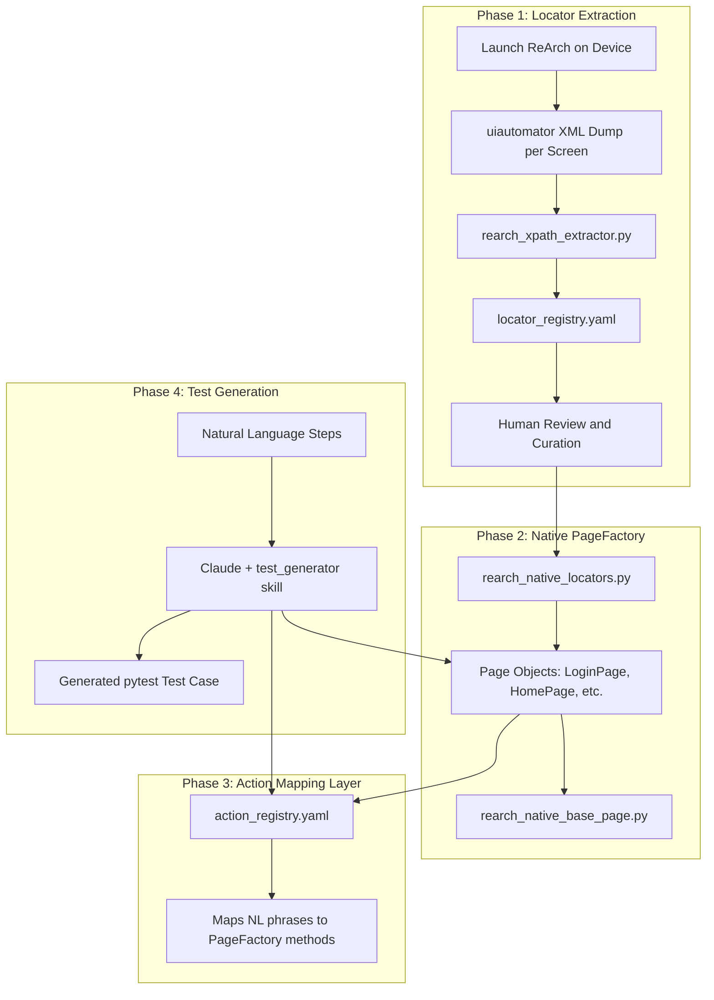

# ReArch Native Test Generation Architecture

## Problem Analysis

The current [rearch_locators.py](PageFactory/ReArch/rearch_locators.py) is a **hybrid WebView/Native** locator file. Most page locators use `By.CSS_SELECTOR` and `By.XPATH` against the **HTML DOM** (WebView context), which only work after switching to `WEBVIEW_com.razorpay.pos` context. However, the ReArch app renders its UI through a WebView that exposes native Android widgets to uiautomator -- meaning the **same elements are accessible as native widgets** without any context switching.

The [rearch_xpath_extractor.py](Tools/rearch_xpath_extractor.py) already proves this: it successfully extracts locators like `(AppiumBy.XPATH, "//android.widget.Button[@text='UPI']")` from `uiautomator dump`, which work directly in `NATIVE_APP` context.

**Conclusion: The native-only approach is correct and superior** -- it eliminates WebView context switching entirely, making tests faster and more reliable.

---

## Architecture Overview




---

## Phase 1: Improve Locator Extraction Pipeline

The current [rearch_xpath_extractor.py](Tools/rearch_xpath_extractor.py) is a solid foundation but needs these improvements:

### 1a. Fix duplicate class names in output

The current [rearch_locators_generated.py](Tools/output/rearch_locators_generated.py) has **4 duplicate `payment_flow` classes** and **2 duplicate `transaction_details` classes**. The script appends blindly without tracking which screens have been captured.

**Fix**: Add a screen registry that prevents duplicate class names and uses distinct names per screen state (e.g., `HomeAmountLocators`, `PaymentMethodLocators`, `CashConfirmLocators`, `PaymentSuccessLocators`).

### 1b. Output a machine-readable locator registry

In addition to the Python file, output a `locator_registry.yaml` that Claude can reference:

```yaml
screens:
  HomeAmountLocators:
    source_xml: xml_dumps/rearch_home.xml
    captured_at: "2026-03-11 20:06"
    elements:
      btn_1: { by: "AppiumBy.XPATH", value: "//android.widget.Button[@text='1']", type: "numpad_digit" }
      btn_upi: { by: "AppiumBy.XPATH", value: "//android.widget.Button[@text='UPI']", type: "payment_method" }
      btn_card: { by: "AppiumBy.XPATH", value: "//android.widget.Button[@text='Card']", type: "payment_method" }
      btn_add_tip: { by: "AppiumBy.XPATH", value: "//android.widget.Button[@text='Add Tip']", type: "action" }
```

### 1c. Add a locator validation mode

A `--validate` flag that launches Appium, navigates to each screen, and verifies that every extracted locator can actually find an element. Outputs a pass/fail report.

### 1d. Recommended screen capture sequence

Update `INTERACTIVE_SCREENS` to cover all critical flows:


| Screen Name              | Navigation Instruction                                  |
| ------------------------ | ------------------------------------------------------- |
| `LoginLocators`          | Login screen (username/password fields)                 |
| `HomeAmountLocators`     | Home page with numpad                                   |
| `PaymentMethodLocators`  | After entering amount, payment method selection overlay |
| `OrderDetailsLocators`   | Order details overlay (order ID, device serial)         |
| `QRPaymentLocators`      | UPI QR code display screen                              |
| `CashConfirmLocators`    | Cash payment confirmation screen                        |
| `PaymentSuccessLocators` | Payment successful result screen                        |
| `PaymentFailedLocators`  | Payment failed result screen                            |
| `TxnHistoryLocators`     | Transaction history list                                |
| `TxnSearchLocators`      | Transaction search screen                               |
| `TxnDetailLocators`      | Single transaction detail view                          |
| `MenuLocators`           | Menu / dashboard page                                   |


---

## Phase 2: Build Native-Only PageFactory

### 2a. New locators file: `rearch_native_locators.py`

Replace the current hybrid [rearch_locators.py](PageFactory/ReArch/rearch_locators.py) with a **native-only** version. All locators use `AppiumBy` -- no `By.CSS_SELECTOR`, no `By.XPATH` against HTML DOM. This file is curated from the `locator_registry.yaml` output.

Key structure:

```python
from appium.webdriver.common.appiumby import AppiumBy

class LoginLocators:
    txt_username = (AppiumBy.ID, "username")
    txt_password = (AppiumBy.ID, "password")
    btn_login    = (AppiumBy.XPATH, "//android.widget.Button[@text='Login']")

class HomeAmountLocators:
    btn_0 = (AppiumBy.XPATH, "//android.widget.Button[@text='0']")
    # ... btn_1 through btn_9
    btn_upi  = (AppiumBy.XPATH, "//android.widget.Button[@text='UPI']")
    btn_card = (AppiumBy.XPATH, "//android.widget.Button[@text='Card']")
    btn_add_tip = (AppiumBy.XPATH, "//android.widget.Button[@text='Add Tip']")

class PaymentSuccessLocators:
    lbl_thank_you = (AppiumBy.XPATH, "//android.widget.TextView[@text='Thank you!']")
    lbl_payment_successful = (AppiumBy.XPATH, "//android.widget.TextView[@text='Payment Successful']")
    btn_view_details = (AppiumBy.XPATH, "//android.widget.Button[@text='View Details']")
    btn_accept_more = (AppiumBy.XPATH, "//android.widget.Button[@text='Accept more payments']")
```

### 2b. Simplified base page: `rearch_native_base_page.py`

Remove all WebView context switching from [rearch_base_page.py](PageFactory/ReArch/rearch_base_page.py). The native approach stays in `NATIVE_APP` context permanently.

Key changes:

- Remove `switch_to_webview()`, `switch_to_native()`, `scroll_to_element_webview()`
- Keep all `wait_for_element`, `perform_click`, `perform_sendkeys`, `fetch_text` methods
- Add native-specific helpers: `scroll_to_text_native()`, `swipe_up()`, `swipe_down()`

### 2c. Page objects remain the same structure

Keep the existing pattern from [rearch_home_page.py](PageFactory/ReArch/rearch_home_page.py), [rearch_login_page.py](PageFactory/ReArch/rearch_login_page.py), etc. but:

- Import from `rearch_native_locators` instead of `rearch_locators`
- Remove all `self.switch_to_webview()` calls
- Update locator references to the native equivalents

This is consistent with the mpos pattern where all locators are native `AppiumBy.ID` tuples and no context switching exists.

---

## Phase 3: Action Mapping Layer

This is the **key enabler** for natural-language-to-code generation. Create a `Tools/action_registry.yaml` that maps human-readable phrases to PageFactory method calls:

```yaml
actions:
  - patterns: ["open rearch", "launch rearch", "open app", "launch app"]
    page: ReArchLoginPage
    method: wait_for_login_page
    import: "from PageFactory.ReArch.rearch_login_page import ReArchLoginPage"

  - patterns: ["login", "enter credentials", "sign in"]
    page: ReArchLoginPage
    method: perform_login
    params: [username, password]
    import: "from PageFactory.ReArch.rearch_login_page import ReArchLoginPage"

  - patterns: ["enter amount {amount}", "type amount {amount}", "key in {amount}"]
    page: ReArchHomePage
    method: enter_amount
    params: [amount]
    import: "from PageFactory.ReArch.rearch_home_page import ReArchHomePage"

  - patterns: ["click upi", "select upi", "pay by upi", "upi payment"]
    page: ReArchHomePage
    method: click_pay_by_upi
    import: "from PageFactory.ReArch.rearch_home_page import ReArchHomePage"

  - patterns: ["verify success", "payment successful", "check success screen"]
    page: ReArchCompletePage
    method: wait_for_success_screen
    import: "from PageFactory.ReArch.rearch_complete_page import ReArchCompletePage"

  - patterns: ["verify failure", "payment failed", "check failure screen"]
    page: ReArchCompletePage
    method: wait_for_failure_screen
    import: "from PageFactory.ReArch.rearch_complete_page import ReArchCompletePage"

  - patterns: ["go to transaction history", "open transactions", "view transactions"]
    page: ReArchHomePage
    method: click_txn_history
    import: "from PageFactory.ReArch.rearch_home_page import ReArchHomePage"
```

Claude reads this registry when generating tests and uses it to map each natural-language step to the correct PageFactory call.

---

## Phase 4: Update Skills Architecture

### 4a. Update `xpath_extractor.md` skill

Current skill tells Claude to extract locators from the **POS frontend repo** -- this is the root cause of the WebView mismatch. Update it to:

- Instruct Claude to use `rearch_xpath_extractor.py` for native locator extraction
- Reference `locator_registry.yaml` as the source of truth
- Never generate `By.CSS_SELECTOR` locators for ReArch

### 4b. Update `test_generator.md` skill

Current skill references "pos repository" for XPaths. Update to:

- Reference `action_registry.yaml` for step-to-method mapping
- Reference `rearch_native_locators.py` for available locators
- Include a test template that follows the pattern in the existing test file (`test_UI_ReArch_PM_UPI_QR_POS_Success_ICICI_DIRECT_01.py`)
- Specify the test structure: SETUP (ResourceAssigner, DB, config) -> EXECUTION (page object calls) -> VALIDATION (DB, API, Portal) -> TEARDOWN

### 4c. New skill: `page_factory_builder.md`

A new skill for Claude to build/extend the PageFactory when new screens are captured:

- Read `locator_registry.yaml` entries for a screen
- Generate a locator class in `rearch_native_locators.py`
- Generate a page object class with business-level methods
- Register new actions in `action_registry.yaml`

### 4d. New skill: `nl_test_generator.md` (Natural Language Test Generator)

The primary skill for the end-goal workflow:

- Input: numbered natural language steps
- Process: match each step against `action_registry.yaml`
- Output: complete pytest test case with proper imports, fixtures, page object calls
- Handles ambiguity by asking clarifying questions
- Includes DB validation stubs based on `db_validation_generator.md`

---

## End-to-End Workflow Example

**Input to Claude:**

```
1. Open ReArch
2. Login with credentials
3. Enter amount 100
4. Click UPI
5. Verify QR screen is displayed
6. Verify payment success
7. Go to transaction history
8. Verify transaction is listed
```

**Claude generates:**

```python
@pytest.mark.usefixtures("log_on_success", "method_setup")
@pytest.mark.appVal
class TestReArchUPIPayment:
    def test_rearch_upi_100(self, appium_driver):
        login_page = ReArchLoginPage(appium_driver)
        home_page = ReArchHomePage(appium_driver)
        qr_page = ReArchQRPage(appium_driver)
        complete_page = ReArchCompletePage(appium_driver)
        txn_history_page = ReArchTxnHistoryPage(appium_driver)

        login_page.wait_for_login_page()
        login_page.perform_login(username, password)

        home_page.wait_for_home_page_load()
        home_page.enter_amount(100)
        home_page.click_pay_by_upi()

        qr_page.wait_for_qr_screen()
        qr_page.validate_qr_screen()

        complete_page.wait_for_success_screen()
        assert complete_page.is_payment_successful()

        complete_page.click_proceed_to_home()
        home_page.click_txn_history()
        # ... transaction verification
```

---

## Migration Strategy

To avoid breaking the existing test that uses WebView locators:

1. Create new files (`rearch_native_locators.py`, `rearch_native_base_page.py`) alongside the old ones
2. New page objects import from native locators
3. Once native PageFactory is validated, deprecate the WebView-based files
4. Existing test (`test_UI_ReArch_PM_UPI_QR_POS_Success_ICICI_DIRECT_01.py`) is migrated last

